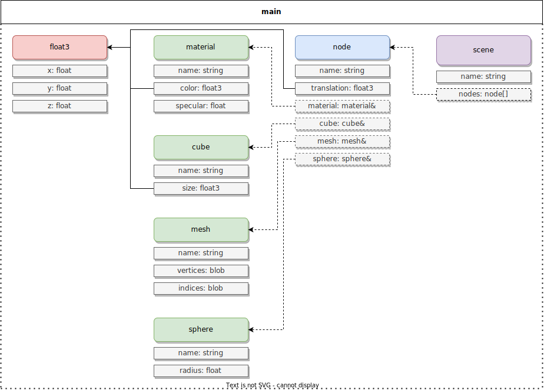

# geometry

The `geometry` example is a simple command-line tool that can import and export Wavefront OBJ model files. On top of that it manages scenes containing nodes referencing reusable shapes and materials. Refer to the final subsection [Command Line](#command-line) for usage details.

Studying, improving and extending the application might be a good way to get more familiar with `Alexandria`. Each section in this document provides some improvement ideas, i.e. new features you could implement. These suggestions aim to have you interact with the library in new and challenging ways.

## Type Definitions



Types are defined in `library.cpp`. They are all placed in the same namespace called `main`. The matching C++ structs all have their own file in the `types` subfolder. This is also where some additional query classes are defined.

`float3` is a basic utility type with an `x`, `y` and `z` component. It is only used as a nested type.

The `material` type defines a very basic material model. It has just a color and a specular value.

There are 3 types that define a shape:

* `cube` is a simple axis-aligned cube with arbitrary size. `sphere` has a radius. 
* `mesh` is a piece of arbitrary geometry. It has two blob members. The first, `vertices`, contains triplets of floats. Each triplet is a vertex. The second, `indices`, contains triplets of ints, each of which defines a triangle.
* `sphere` is a, well, sphere. It has just a radius.

The `node` type combines a material and shape. It keeps references to a `material` and one of the 3 shapes. It also has a translation to place the shapes at an arbitrary location in a `scene`. This last type has just a list of references to nodes. Because they are references, nodes can be shared between scenes.

**Improvement ideas:**

* Extend `material` to allow embedding some (randomly) generated texture data as a blob.
* Extend `mesh` and `node` to allow a list of materials with a per-triangle material index.
* Extend `sphere` to allow specifying the number of vertices that are generated during export.
* Extend `node` to also have a rotation and scale (note that especially rotation will probably require a slightly more extensive linear algebra library).
* Add more types and extend `mesh` to allow sharing of vertex and index buffers to optimize memory usage.

## Queries

### Custom Insert Queries

Instead of directly using the `alex::InsertQuery` classes, some custom implementations are used. These perform additional validation just before invoking the base methods that write to the database. For instance, the `CubeInsertQuery` checks that the name of the instance is not empty, nor that its size along any of the axes is below zero.

```cpp
// class CubeInsertQuery {...

void operator()(object_t& instance) override
{
    if (instance.name.empty())
        throw std::runtime_error("Cannot insert cube without name.");
    if (instance.size.x <= 0 || instance.size.y <= 0 || instance.size.z <= 0)
        throw std::runtime_error("Cannot insert cube with size <= 0.");

    return InsertQuery::operator()(instance);
}

// ...};
```

**Improvement ideas:**

* Add more validation for e.g. the `mesh` type to check whether the indices are in range of the vertex list.
* Add custom classes for the get queries that validate and fix objects that may be broken.

### Complex Search Queries

The `--users` command runs a complex search query to find, for a specified instance, which other instances reference it. For example, which `nodes` reference a certain `material`. An even more complex query is the one that finds the `scenes` which include a `node`. This query has to perform a join across 3 tables: The `scene` instance table, the `node` instance table, and the `nodes` reference array table. Below a visual representation.



In order to perform this query, we must do 4 things:

1. Get the two instance tables and reference array table.
2. Get the necessary columns from each table by index or name.
3. Construct and compile the query.
4. Run the query and iterate over results.

```cpp
// [1]
// Scene instance table.
auto& sceneTable      = tablesScene.getInstanceTable();
// Node instance table.
auto& nodeTable       = tablesNode.getInstanceTable();
// Reference array table for nodes property of scene type.
auto& nodeArrayTable  = tablesScene.getReferenceArrayTable<"nodes">();

// [2]
// The columns in the reference array table pointing to scene and node are at a fixed index.
auto  sceneRefColumn  = nodeArrayTable.col<1>();
auto  nodeRefColumn   = nodeArrayTable.col<2>();
// The columns in the instance tables can be retrieved by the name that we specified in the TypeDescriptor.
auto  sceneIdColumn   = tablesScene.getInstanceColumn<"id">();
auto  sceneNameColumn = tablesScene.getInstanceColumn<"name">();
auto  nodeIdColumn    = tablesNode.getInstanceColumn<"id">();

// [3]
                        // Joining scene instance table with array table.
auto  stmt            = sceneTable.join(sql::InnerJoin, nodeArrayTable)
                        .on(sceneRefColumn == sceneIdColumn)
                        // Joining node instance table with array table.
                        .join(sql::InnerJoin, nodeTable)
                        .on(nodeRefColumn == nodeIdColumn)
                        // Select scene name.
                        .selectAs<std::string>(sceneNameColumn)
                        // Filter for specified node.
                        .where(sql::like(nodeIdColumn, id.getAsString()))
                        // Grouping by id will drop duplicates.
                        .groupBy(sceneIdColumn)
                        .compile()
                        .bind(sql::BindParameters::All);

// [4]
std::cout << "Scenes referencing node: \n";
for (const auto& name : stmt) std::cout << name << std::endl;
```

**Improvement ideas:**

* Create a search query that finds all materials that have a red channel larger than a user specified threshold.
* Create a search query that finds all unused meshes.

### Clean Query

## Import

The OBJ importer is implemented in `import.cpp`. It imports a single `.obj` file (and potentially a matching `.mtl` file) and creates a `scene` instance from it.

All materials in the `.mtl` file are inserted as a single `material` instance. While OBJ supports a decent number of properties as well as texturing, only the diffuse and specular values are supported.

Each shape in the `.obj` file is turned into a `mesh` and then added to a `node`, with the `material` of the first triangle. Note that the importer is not the most efficient when it comes to extracting the vertex data. No vertices are shared between meshes, and vertices shared by multiple triangles within a shape are cloned.

**Improvement ideas:**

* When importing a material, run a query to check if a material with the same name already exists and use that one instead.

## Export

The OBJ exporter is implemented in `export.cpp`. It exports a single `scene` instance to an `.obj` and `.mtl` file pair.

Each unique material referenced by any of the scene's nodes is written to the `.mtl` file. Duplicates are not exported more than once.

The shape referenced by each node is converted to a list of vertices and indices. For the `cube` and `sphere` that means some geometry is generated on the fly, while the `mesh` buffers are written as-is.

Since OBJ does not support any information about the transforms of objects, all vertices are converted to global space using the `translation` of each `node`. Additionally, no vertices can be shared by e.g. cubes, even though typically their only difference is that they are located elsewhere and have a different scale. A more complete format would handle this.

**Improvement ideas:**

* Export to another format (e.g. glTF) that supports transforms and nodes sharing meshes.

## Command Line

When you run the application, a console is opened that runs a loop reading commands. At present, there are 9 supported commands, each of which is described below.

**Improvement ideas:**

* Add a command to remove nodes from a scene.

### append

The `--append` command can be used to add existing nodes to an existing scene instance. It requires specifying the `--identifier` of the scene and a list of one or more `--nodes` to be added.

```c
> --append --identifier=8d75fd0b-a385-4a98-adb9-f8a7d1bcb503 --nodes=c5282816-382b-40c8-b83c-7498842296c2,3d373f0d-5499-4ec3-ac9c-2c4893bec0d7
Appended 2 nodes to scene with id=8d75fd0b-a385-4a98-adb9-f8a7d1bcb503
```

### clean

### create

The `--create` command can be used to insert a new shape, node or scene instance. To specify the type, pass the corresponding flag (e.g. `--cube`). Then provide all the the required properties.

```c
> --create --cube --name=mycube --size=4.5,4,8
Created cube with id=c38dcfdc-7b30-46c8-91f9-a147cca7e253

> --create --sphere --name=mysphere --radius=5
Created sphere with id=85ea058b-ee76-43b5-ad55-8294874b8ffc

> --create --material --name=red --color=1,0,0 --specular=0
Created material with id=65f14ca1-4968-490d-93df-d19b4d3c5300

> --create --node --name=a --translation=4,0,0 --mtl=65f14ca1-4968-490d-93df-d19b4d3c5300 --cube --identifier=c38dcfdc-7b30-46c8-91f9-a147cca7e253
Created node with id=c5282816-382b-40c8-b83c-7498842296c2

> --create --node --name=a --translation=4,0,0 --mtl=65f14ca1-4968-490d-93df-d19b4d3c5300 --sphere --identifier=85ea058b-ee76-43b5-ad55-8294874b8ffc
Created node with id=3d373f0d-5499-4ec3-ac9c-2c4893bec0d7

> --create --scene --name=example --nodes=c5282816-382b-40c8-b83c-7498842296c2,3d373f0d-5499-4ec3-ac9c-2c4893bec0d7
Created scene with id=16f366c2-9ba4-45fa-b736-0a1fd3ef61ce
```

### delete

The `--delete` command can be used to delete any instance. It requires specifying the type flag and an instance `--identifier`.

```c
> --delete --cube --identifier=c38dcfdc-7b30-46c8-91f9-a147cca7e253
Deleted cube with id=c38dcfdc-7b30-46c8-91f9-a147cca7e253
```

### export

The `--export` command can be used to write a scene to an OBJ file. It requires specifying a scene `--identifier`. Optionally, you can provide a path to a `--file`.

```c
> --export --identifier=16f366c2-9ba4-45fa-b736-0a1fd3ef61ce --file=mymodel.obj
```

### import

The `--import` command can be used to read a scene from an OBJ file. It requires specifying a path to a `--file`.

```c
> --import --file=monkey.obj
Importing "monkey.obj"
  Created material 7eda8032-3264-4791-ab42-424639c19700
  Created mesh b7ffaf91-403f-44d5-89ca-c5d394ab58a2
  Created node 529a7638-3cfd-41d6-9ee0-267bfb644d6a
Created scene 8d75fd0b-a385-4a98-adb9-f8a7d1bcb503
```

### inspect

The `--inspect` command can be used to view the properties of an object. It requires specifying the type flag and an instance `--identifier`.

```c
> --inspect --cube --identifier=c38dcfdc-7b30-46c8-91f9-a147cca7e253
Cube{name=mycube, size=[4.5, 4, 4.5]}
```

### list

The `--list` command can be used to display all objects in the database. You can either pass a limited set of type flags or `--all`.


```c
> --list --node --sphere
Nodes:
name=a id=c5282816-382b-40c8-b83c-7498842296c2
name=a id=3d373f0d-5499-4ec3-ac9c-2c4893bec0d7
Spheres:
name=mysphere id=85ea058b-ee76-43b5-ad55-8294874b8ffc
```

### users

The `--users` command can be used to find all objects that reference a material, shape or node. It requires specifying the type flag and an `--identifier`.

```c
> --users --cube --identifier=c38dcfdc-7b30-46c8-91f9-a147cca7e253
Nodes referencing cube:
a
```
